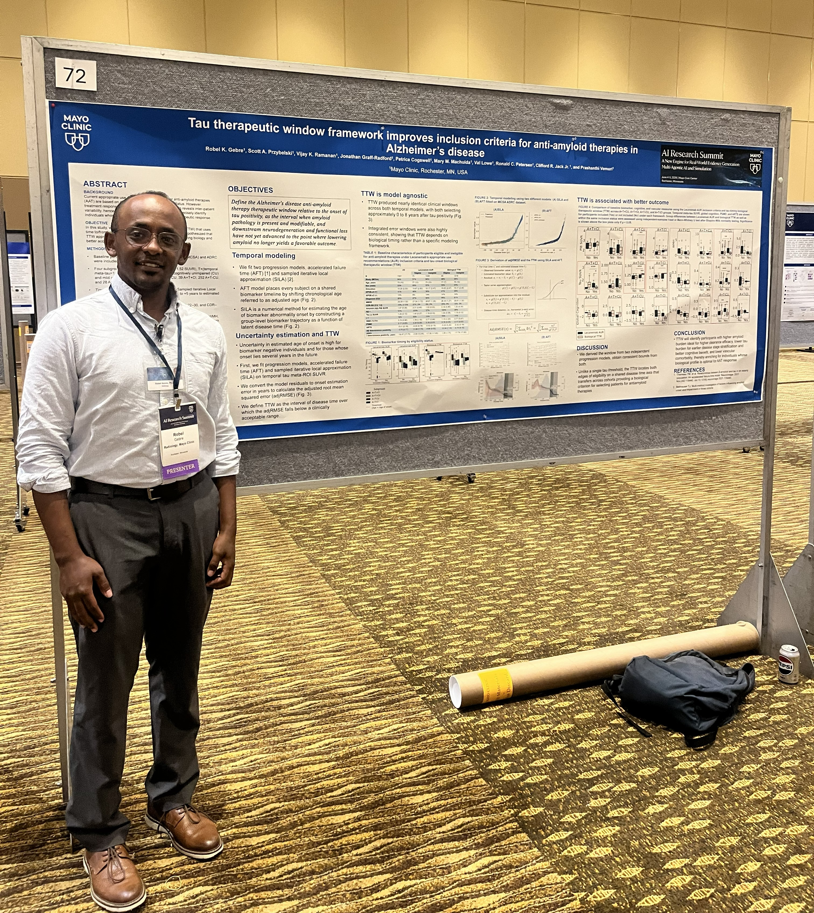

## Overview

I presented two pieces of work at the Mayo Clinic AI Summit: a podium talk on automated PET tracer classification and a poster on the tau therapeutic window.

## PET Tracer Classification

The classifier reads a brain PET volume and predicts which radiotracer produced it. It uses a 2.5D ConvNeXt backbone and reached a Matthews correlation coefficient of 0.93 across tracer classes. Reliable tracer labels matter for any pipeline that pools amyloid, tau, and FDG scans, so this model removes a manual step that scales poorly across thousands of images.

## Tau Therapeutic Window

The poster defined the tau therapeutic window, a tau PET SUVR range over which anti-amyloid therapy can plausibly alter the disease course. I estimated the window in the Mayo PROMOD cohort with two independent models, SILA and an accelerated failure time model. The estimates converged within 0.3 years and gave a window over the SUVR range [1.28, 1.51].

## Photos

